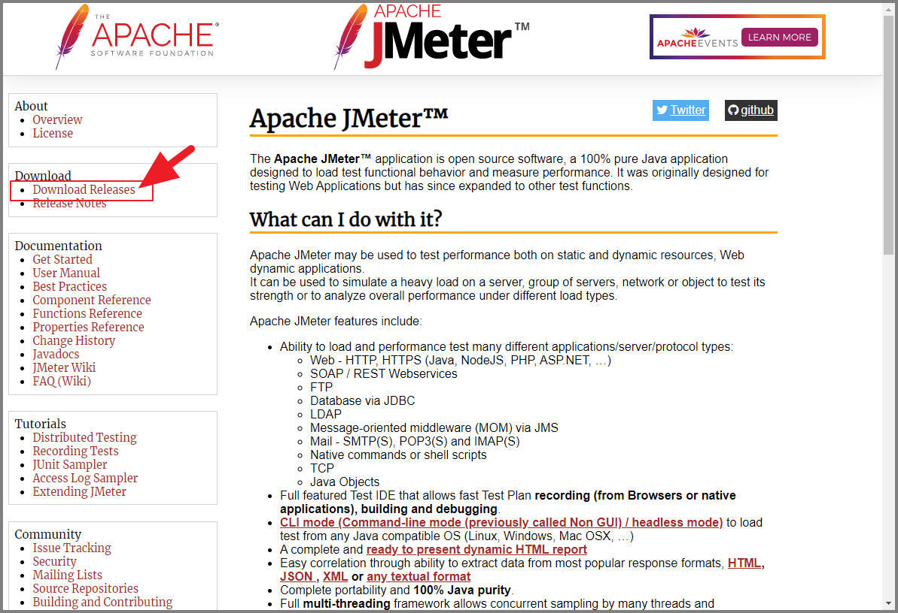
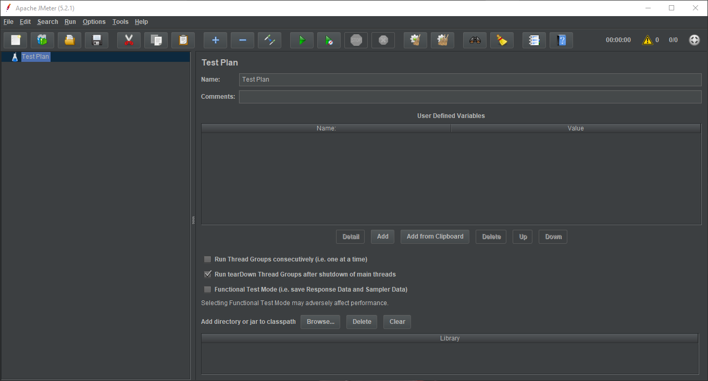
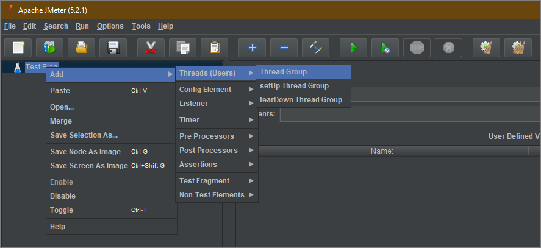
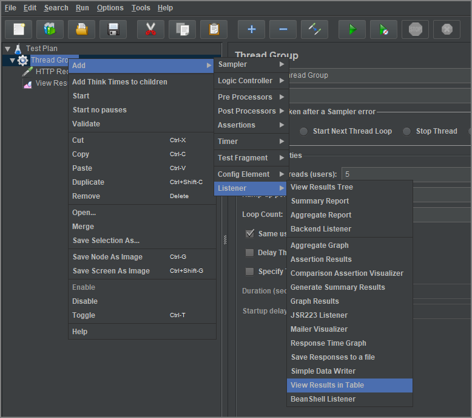

# JMeter
JMeter 是開源軟體 Apache 基金會下的一個負載測試工具，用來測試部署在伺服器端的應用程式的效能。

什麼是負載測試？舉個例子，你開了一個網路商店，興沖沖地準備雙十一大幹一把，沒想當天活動的時候大量用戶一訪問你的網店，你的網店就掛了，那怎麼辦？辦法就是在實際搞活動之前，先測試一下以確認系統能承受那麼多少用戶，當然測試的時候我們不需要請真正的這麼多實際用戶，否則得花多少錢啊！  

JMeter 能夠模擬大量用戶訪問的軟體，而且它是開源的，不花錢！

## 安裝
* 下載
可以在 [JMeter 官方網站][JMeter] ( 如下圖 ) 後，再切換到 **[Download Releases][Ref001]** 頁面下載。

      

* 下載 .zip 檔案。
    

* 解壓縮後執行 **bin\jmeter.bat** 批次檔就可以開啟 JMeter 的圖形介面
    

* JMeter 的圖形介面
    

### 未能正常開啟 JMeter 圖形介面
執行 **jmeter.bat** 後若未開啟 JMeter 的圖形介面，並且出現以下訊息:

    Not able to find Java executable or version. Please check your Java Installation.

這是因為 JMeter 是由 JAVA 撰寫開發，所以安裝 **JDK** 到電腦，可以自行到 **ORACLE** 下載安裝包。

## 開始使用
### 主要概念
* **測試計畫 ( Test Plan ):**  
所有的測試工作都基於測試計劃進行，個別專案中僅能具備單一測試計畫，也就是做為專案的全局設置。

* **執行緒組合 ( Threads(Users)\Thread Group ):**  
相當於許多執行緒的組合，在個別專案中有多個執行緒組合，對特定標的進行測試的各種不同呼叫的執行緒集合的概念，例如待測網站 A 及 網站 B 時，應建立兩個不同執行緒組合。

* **HTTP 要求 ( Sampler\HTTP Request ):**  
HTTP 要求的原理是通過建立多條 HTTP 要求，從而達到測試網站負載及效能的作用，最常見的即是 HTTP 要求這類，其他還有資料庫測試、FTP 測試等。

### 1. 新增 Thread Group

* 設定測試數量  
每次測試的數量，是透過 **執行緒數量 Number of Threads(users)** 及 **循環數量 Loop Count** 的乘數。
  

### 2. 新增 HTTP Request

* 設定 HTTP Request 

完整設定可以參考 [使用手冊的 18.1.2 HTTP Request][Ref004] 的說明，簡單說明必要的參數如下：  
* Basic    
    * Web Server
        * **Proptocol[http]:** 可以填入到 **HTTP** 及 **HTTPS** 兩種不同的協議。
        * **Server Name or IP:** 網頁的伺服器名稱或是 IP 位址。
        * **Port Number:** 埠號，預設 HTTP/HTTPS 的 80 埠號，可以設定自訂的不同埠號。
    * HTTP Request
        * **Method:** 各個不同呼叫模式，例如 Get, Post 方法。
        * **Path:** 路徑，待測試的網址路徑。
        * **Redirect Automatically:** 勾選後，在網頁轉址時，將轉址與原請求視窗同一請求。
        * **Follow Redirects:** 勾選後，在網頁轉址時，將轉址視為個別不同請求。
        * **Use KeepAlive:** 設定 HTTP 呼叫的 Keep-Alive 設定。
    * **Parameters:** 提供設定網頁後綴參數。
### 3. 新增監聽器
執行測試後，如何收集測試結果，可以透過監聽器在執行過進行結果收集，以下列示兩種不同的監聽器，分別以樹狀結構及列表形式表示測試結果。
* View Results Tree

* View Results in Table

## 參考文件
* [官方使用手冊][JMeterManual]
* [Jmeter 使用指南][Ref002]
* [JMeter multipart/form-data 請求自定義 body data 簡述][Ref003]

[JMeter]:https://jmeter.apache.org/
[JMeterManual]:https://jmeter.apache.org/usermanual/index.html

[Ref001]:https://jmeter.apache.org/download_jmeter.cgi
[Ref002]:https://www.cnblogs.com/st-leslie/p/5185376.html
[Ref003]:https://www.itread01.com/content/1541152143.html
[Ref004]:http://svn.apache.org/repos/asf/jmeter/tags/v2_8/docs/usermanual/component_reference.html#HTTP_Request

